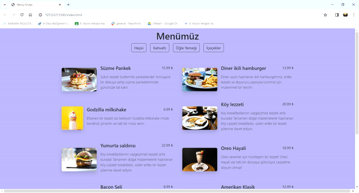

<h1> Menu Finder</h1>

I designed a menu website for a restaurant in my new project using HTML5, CSS3, and JavaScript. I made the categories dynamic on the menu. You can review the details by checking my code

<h2> Used Technologies </h2>

HTML5, CSS3, JS

<h2> SCREENSHOT </h2>

